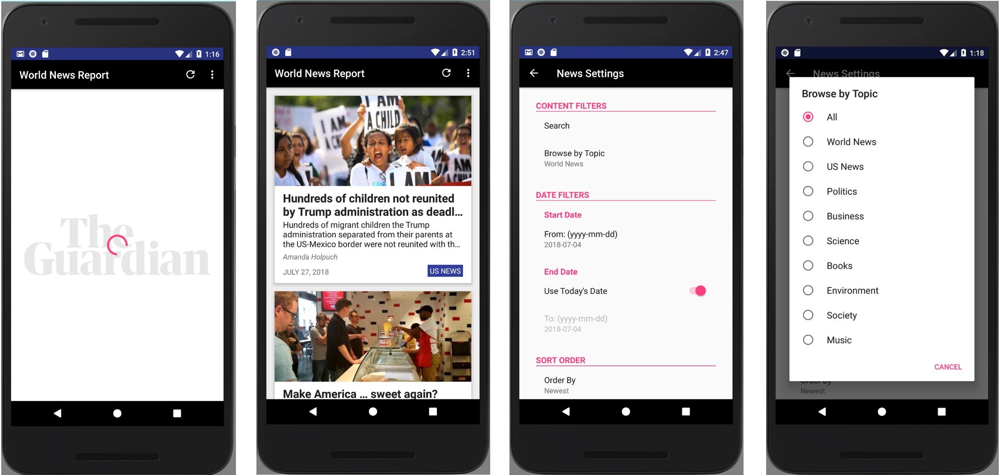

## Grow With Google Android Basics Nanodegree: PROJECT 6
# World News Report - News App

Used **API 27: Android 8.1 (Oreo)**

## Screenshots

## About
This project is a news feed app that gives regularly updated news from the Guardian API, with stories based on preferences set by the user.

## Features
- Search option
- Filter by topic and date
